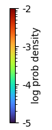
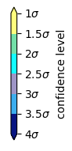
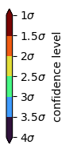

# DarkLensCode
Code to generate mass-distance plots for microlensing events.

## Installation with pip
Install darklens with pip. For now this can be done only locally:
``` sh
python3 -m pip install -e .
```

## Manual installation

Dependencies can be installed with pip.
``` sh
python3 -m pip install -r requirements.txt
```
It is recommended to use a virtual environment.
## How to use

### Running code

#### Running code with command line parameters
To use the Dark Lens Code you need a file with chains from
the lensing model in .npy format and a .txt file with the parameters of the event. 

The results will be saved to files with results_filename and prefixes.

Having them, you can run the code.
``` sh
darklens chain_file.npy parameters_file.txt results_filename
```

### File with parameters

File with parameters in .txt format should contain event parameters in the following order
```
alpha [deg]   delta [deg]   t0par [JD − 2450000]   extintion   dist_s [kpc]  dist_s_max [kpc]  dist_s_min [kpc]  mu_ra [mas/yr]   mu_ra_sig [mas/yr]   mu_dec [mas/yr]  mu_dec_sig [mas/yr]  mu_ra_dec_corr
```
Parameters should be separated with tabulator.
If you know distance to the source dist_s_max = dist_s + sigma and dist_s_min = dist_s - sigma.
Otherwise, look at --ds_weight flag.

### Using YAML file as input parameter
The User can create a YAML file with input parameters. A few examples of such file are located in the [Examples section](#https://github.com/BHTOM-Team/DarkLensCode/tree/kk_dev/examples).
``` sh
darklens input_params.yaml
```
The YAML file is split into three sections:
- Input (```input```)
- Parameters (```parameters```)
- Options (```options```)
- Output (```output```)

#### Input
Input contains one field, ```samples``` with subfield ```file_name``` which provides a path to the file with the microlensing model parameter's posterior distribution. See: [File with chains](### File with chains).

#### Parameters
This section has to contain the following subfields:
- ```alpha``` -- Right Ascention of the event
- ```delta``` -- Declination of the event
- ```t0par``` -- t_0,par of the microlensing model.
- ```extinction``` -- extinction towards the event in the same filter as the model flux parameters are provided.
- ```dist_s``` -- most likely distance to the source.
- ```dist_s_min``` -- minimal distance to the source.
- ```dist_s_max``` -- maximal distance to the source.
- ```mu_ra``` -- proper motion in the RA. 
- ```mu_ra_sig``` -- uncertainty of the proper motion in the RA.
- ```mu_dec``` -- proper motion in the declination.
- ```mu_dec_sig``` -- uncertainty of the proper motion in the declination.
- ```mu_ra_dec_corr``` -- correlation between proper motion elements.

#### Options
This section has to contain the following subfields:
- ```ds_weight``` -- see [ds_weight](#ds_weight)
- ```mus_weight``` -- see [mus_weight](#mus_weight)
- ```n_iter``` -- see [n_iter](#n_iter)
- ```masspower``` -- see [masspower](#masspower)
- ```filter``` -- see [filter](#filter)
- ```f_source``` -- see [f_source](#f_source)

#### Output
This section has to contain the following subfields:
- ```samples``` with two fields: ```samples_filename``` where the generated posterior distributions are saved, and ```results_filename``` where summary information is saved.
- ```plot``` with one field: ```plot_name``` where the output plots are saved.

## Input parameter description

### File with chains

File with chains in .npy format should contain a tuple of tuples of lens parameters.
The parameters should be in the following order:
```
t0 [JD − 2450000]   u0  tE [days]   piEN    piEE    mag0    flux_fraction
```
These parameters have to be in the geocentric frame. They are transferred into a heliocentric frame inside the Dark Lens Code.
#### Flags

You can use flags to run code with specific options.
Flags should be placed between calling the program and giving its arguments.
Example:
``` sh
darklens --niter 1e7 chain_file.npy parameters_file.txt plotname
```
### ds_weight
Use when you do not know the distance to the source and 
want to weigh it with a galaxy model.
In this case dist_s_min and dist_s_max are the ends of the distance sampling range.
The default is False.
``` sh
--ds_weight True
```
### mus_weight
Use when you do not know the proper motion to the source and 
want to weigh it with a galaxy model.
The default is False.
``` sh
--mus_weight True
```

### f_source
A flag that tells the programme what type of total flux_fraction is provided. 
If set to True, the flux_fraction provided in the chains [file with chains](#File with chains)
is defined as flux_fraction = F_s / (F_s + F_b), where the F_s and F_b are flux of the source and blend respectively.
Otherwise the programme will assume that flux_fraction is defined as flux_fraction = F_b / (F_s + F_b).
The default is True.
``` sh
--f_source False
```

### niter
Use to change number of iterations. The default 1e6.
``` sh
--niter 5e6
```
### masspower
Use to change mass function slope power index and the break points provided as numbers separated with commas.
There should always be an even number of numbers provided. The first one correspons to the function's slope, the 
second one to its break-off point, after which another slope in sequence should be used.
The default -1.75 with the break point at 1000 solar masses. To be more precise, this means that mass function g(M)=M^masspower, where M<M_break.
``` sh
--masspower -2.00, 1000.
```
Kroupa initial mass function would be provided like this:
``` sh
--masspower -0.3, 0.08, -1.3, 0.5, -2.3, 150.
```

### filter
Use to choose filter used in your model. Filters available: V, I, G, K.
The default G.
``` sh
--filter V
```
### samples
Use to save samples in .npy format
``` sh
--samples True
```
Samples colums:
```
weight   M_L [Solar masses]   D_L [kpc]  mag_blend   mag_lens_with_extinction  mag_lens_without_extinction  mag_source  t0 [JD - 2450000]   tE [days]   u0  piEN  piEE  mag0	fs	mu_rel [mas/yr]
```

## Plotting

After running the ```darklens``` command, a csv file with results parameters will be saved.
These parameters can be used to plot the results using the command:

``` sh
darklens-plot [options] yaml_filename
```

The YAML file has to contain:

- **samples filename**- result of the ``darklens`` command
- **plot filename**- prefix and extension of the plot filenames
- **parameters**

The plots will be saved in a **plots** directory, created if non-existent. 

### Choosing the color

A continuous mode is available, for which the colors correspond to log prob density.
The turbo colormap is color-blind friendly.



and two sigma contour palettes, which correspond to sigma values- peacock colormap and turbo (color-blind friendly) colormap.




### Options

#### plot type
Plot the distributions either using the continuous log density scale or 
in a discrete colormap according to the sigma values.

Available colormaps for the sigma values are turbo (``sigma`` option) and peacock (``sigma-peacock`` option).
Log density (``log-density`` option) plot uses the turbo colormap. It is the default option.
``` sh
-p [log-density|sigma|sigma-peacock]
--plot-type [log-density|sigma|sigma-peacock]
```
#### bins
Binning can be changed for mass-distance and blend-lens plots. The defaults are all 100.

Too small binning values can lead to an error -- the contour levels must be increasing which might be impossible for
a small number of bins.

Accepted range is [10, 500], for other values the default value of 100 will be used.

``` sh
-hb 50
--histogram-bins 50
```
